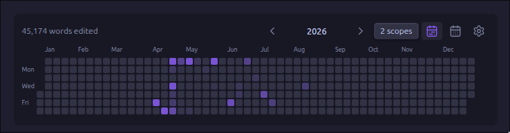

# Edit History Heatmap

See when you write. Edit History Heatmap turns your Obsidian Sync version history into a contribution graph for your vault.



It can track words, lines, or characters, and show either total activity or additions and removals separately. Hover over a day for the file breakdown, or drag across several days to total them up.

## Using it

Open **Edit History Heatmap: Open heatmap**, click **Scope**, and pick any folders or tags you want to include. Nothing is scanned until you choose a scope. Opening the scope menu pauses the current scan, and closing it starts scanning your new selection.

The sidebar shows a month calendar. To put the rolling year heatmap in a note, use:

````markdown
```edit-history-heatmap
```
````

Put `month` inside the block if you want it to start in month view.

## A few things to know

- Obsidian Sync is required. Other sync services do not provide the version history this plugin needs.
- The plugin uses an undocumented Obsidian Sync API, so a future Obsidian update could break it.
- Old note contents are compared in memory and are never saved by the plugin.
- The cache only contains dates, file paths, version IDs, and aggregate counts. There is no telemetry.
- The oldest available Sync version is used as a baseline. History that Obsidian Sync no longer retains cannot be recovered.
- If community plugin settings are included in your Sync configuration, the aggregate cache can be shared between devices.

## Installing

Until it is available in the Obsidian Community directory, install it with [BRAT](https://github.com/TfTHacker/obsidian42-brat), or copy `main.js`, `manifest.json`, and `styles.css` from a release into:

```text
<vault>/.obsidian/plugins/edit-history-heatmap/
```

## Development

```bash
npm install
npm run lint
npm test
npm run build
```

Made by **wavey**. Licensed under [MIT](./LICENSE).
